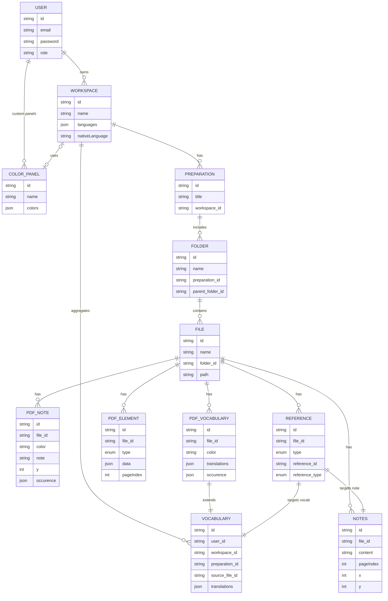

```mermaid
erDiagram
    direction TB

    USER {
        string id
        string email
        string password
        string role
    }

    WORKSPACE {
        string id
        string name
        json languages
        string nativeLanguage
    }

    COLOR_PANEL {
        string id
        string name
        json colors
    }

    PREPARATION {
        string id
        string title
        string workspace_id
    }

    FOLDER {
        string id
        string name
        string preparation_id
        string parent_folder_id
    }

    FILE {
        string id
        string name
        string folder_id
        string path
    }

    PDF_NOTE {
        string id
        string file_id
        string color
        string note
        int y
        json occurence
    }

    PDF_VOCABULARY {
        string id
        string file_id
        string color
        json translations
        json occurence
    }

    PDF_ELEMENT {
        string id
        string file_id
        enum type
        json data
        int pageIndex
    }

    REFERENCE {
        string id
        string file_id
        enum type
        string reference_id
        enum reference_type
    }

    VOCABULARY {
        string id
        string user_id
        string workspace_id
        string preparation_id
        string source_file_id
        json translations
    }

    NOTES {
        string id
        string file_id
        string content
        int pageIndex
        int x
        int y
    }

    USER ||--o{ WORKSPACE : "owns"
    USER ||--o{ COLOR_PANEL : "custom panels"
    WORKSPACE ||--o{ PREPARATION : "has"
    WORKSPACE ||--o{ VOCABULARY : "aggregates"
    WORKSPACE |o--o| COLOR_PANEL : "uses"
    PREPARATION ||--o{ FOLDER : "includes"
    FOLDER ||--o{ FILE : "contains"
    FILE ||--o{ PDF_NOTE : "has"
    FILE ||--o{ PDF_VOCABULARY : "has"
    FILE ||--o{ PDF_ELEMENT : "has"
    FILE ||--o{ REFERENCE : "has"
    FILE ||--o{ NOTES : "has"
    PDF_VOCABULARY ||--|| VOCABULARY : "extends"
    REFERENCE ||--|| NOTES : "targets note"
    REFERENCE ||--|| VOCABULARY : "targets vocab"
```
