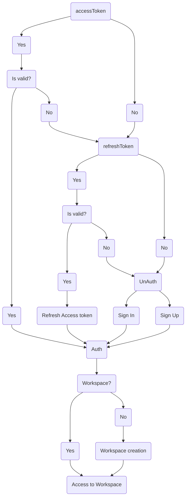

```mermaid
---
config:
  theme: mc
---
flowchart TD
    C["Auth"] --> n1["Workspace?"]
    n1 --> n2["Yes"] & n3["No"]
    D["UnAuth"] --> n4["Sign In"] & n5["Sign Up"]
    n4 --> C
    n5 --> C
    n2 --> n6["Access to Workspace"]
    n7["accessToken"] --> n8["Yes"] & n9["No"]
    n8 --> n10["Is valid?"]
    n10 --> n11["Yes"] & n12["No"]
    n9 --> n13["refreshToken"]
    n13 --> n14["Yes"] & n19["No"]
    n14 --> n15["Is valid?"]
    n12 --> n13
    n15 --> n16["Yes"] & n17["No"]
    n16 --> n18["Refresh Access token"]
    n11 --> C
    n18 --> C
    n17 --> D
    n19 --> D
    n3 --> n20["Workspace creation"]
    n20 --> n6
    C@{ shape: rounded}
    n1@{ shape: rounded}
    n2@{ shape: rounded}
    n3@{ shape: rounded}
    D@{ shape: rounded}
    n4@{ shape: rounded}
    n5@{ shape: rounded}
    n6@{ shape: rounded}
    n7@{ shape: rounded}
    n8@{ shape: rounded}
    n9@{ shape: rounded}
    n10@{ shape: rounded}
    n11@{ shape: rounded}
    n12@{ shape: rounded}
    n13@{ shape: rounded}
    n14@{ shape: rounded}
    n19@{ shape: rounded}
    n15@{ shape: rounded}
    n16@{ shape: rounded}
    n17@{ shape: rounded}
    n18@{ shape: rounded}
    n20@{ shape: rounded}
```
