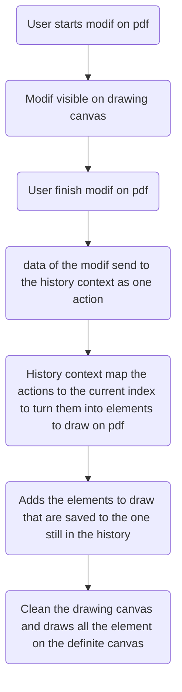

```mermaid
---
config:
  theme: mc
---
flowchart TD
    A["User starts modif on pdf"] --> B["Modif visible on drawing canvas"]
    B --> C["User finish modif on pdf"]
    C --> n1["data of the modif send to the history context as one action"]
    n1 --> n2["History context map the actions to the current index to turn them into elements to draw on pdf"]
    n2 --> n3["Adds the elements to draw that are saved to the one still in the history"]
    n3 --> n4["Clean the drawing canvas and draws all the element on the definite canvas"]
    A@{ shape: rounded}
    B@{ shape: rounded}
    C@{ shape: rounded}
    n1@{ shape: rounded}
    n2@{ shape: rounded}
    n3@{ shape: rounded}
    n4@{ shape: rounded}
```
